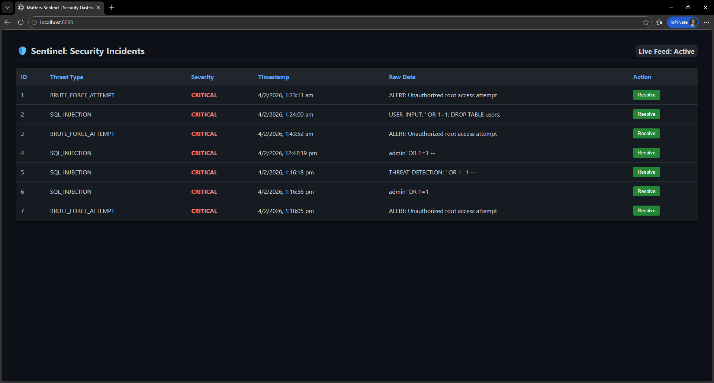

# 🛡️ Sentinel | Enterprise Headless Security Engine

**Sentinel** is a high-performance telemetry monitoring system built with **Java 21**. It scans incoming data streams for malicious patterns (SQL Injection, Brute Force) and visualizes threats in real-time through a live dashboard.

---

## 🚀 Live Preview
 
*Note: A real-time view of the Sentinel dashboard monitoring incoming threats.*

---

## 🧠 Core Architecture
- **Headless Processing:** Runs as a background service to ingest logs via REST API.
- **Strategy Pattern:** Decoupled detection logic allowing for modular security rule updates.
- **Concurrency:** Uses Java threads to ensure non-blocking telemetry analysis.
- **Persistence:** Full audit trail of security incidents stored in PostgreSQL.

## 🛠️ Tech Stack
- **Backend:** Java 21, Spring Boot 3.4.2, Spring Data JPA
- **Database:** PostgreSQL
- **Security:** Spring Security (Role-based access)
- **Frontend:** Vanilla JavaScript (Fetch API), CSS3, HTML5

---

## 💻 Getting Started

### Prerequisites
- JDK 21
- PostgreSQL 16+
- Maven

### Installation & Run
1. **Clone the repository:**
   ```bash
   git clone [https://github.com/akshay3753/Sentinel.git](https://github.com/akshay3753/Sentinel.git)
